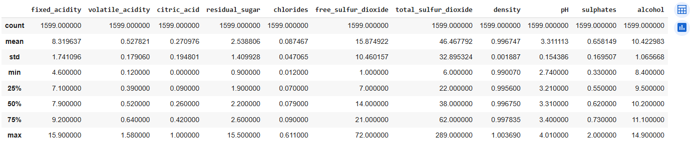
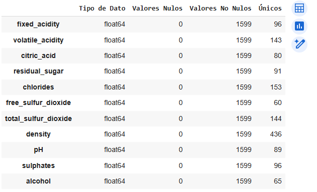
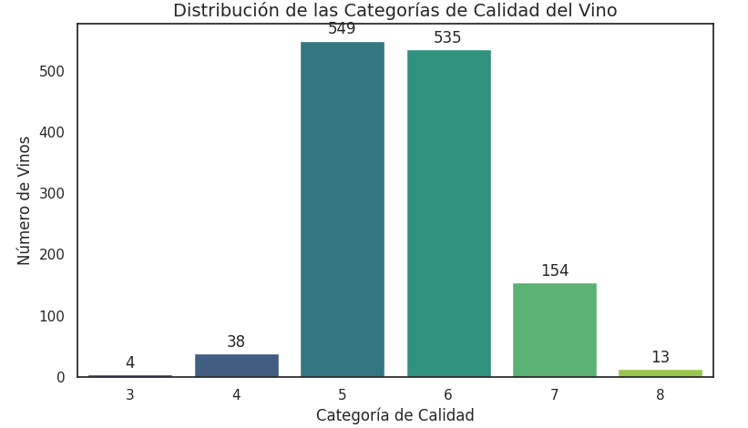
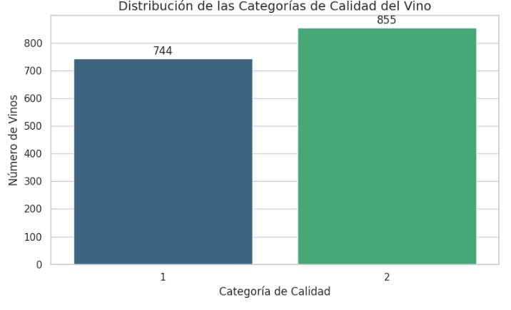
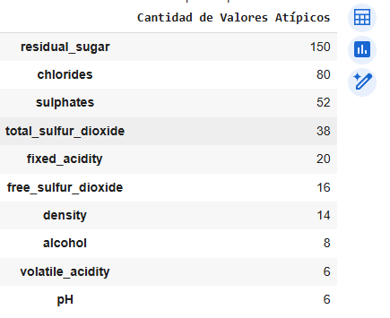
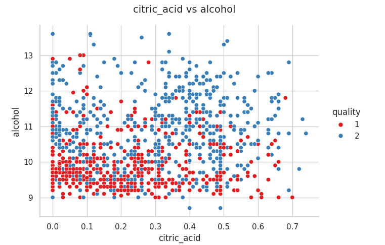
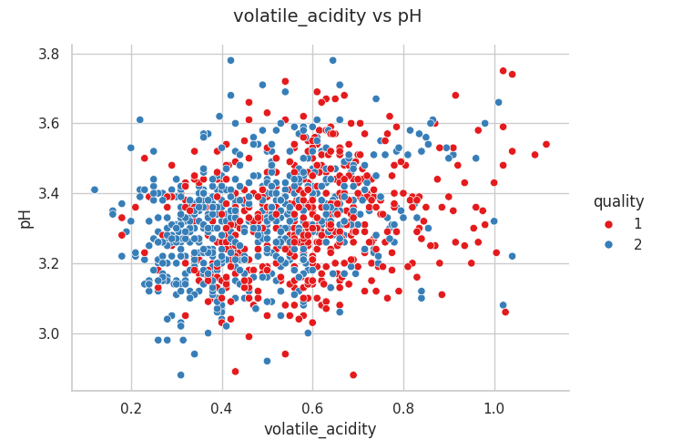
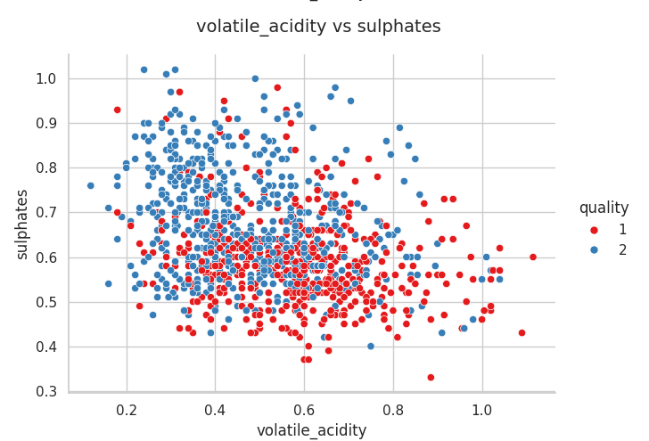
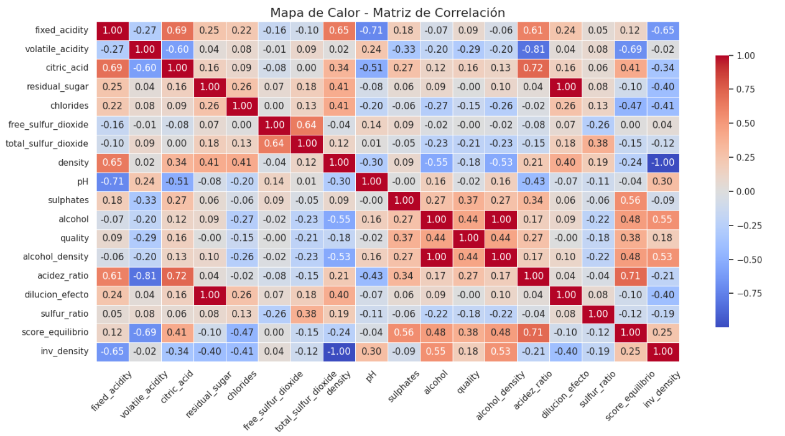
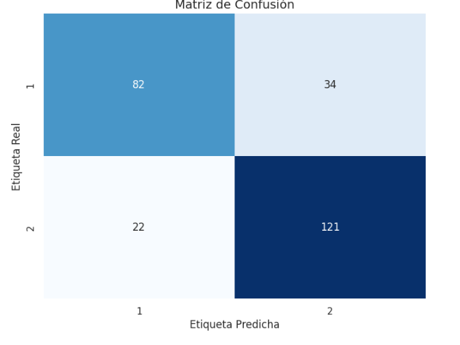

# 🍷 Wine Quality EDA - Análisis Exploratorio del Dataset de Calidad del Vino

Este repositorio contiene un análisis exploratorio de datos (EDA) realizado sobre el dataset de *Wine Quality (Red Wine)*, disponible en el [UCI Machine Learning Repository](https://archive.ics.uci.edu/ml/datasets/Wine+Quality). Este proyecto fue desarrollado con el objetivo de demostrar habilidades en análisis de datos, visualización, y comunicación de hallazgos.

> También puedes modificar fácilmente el código para trabajar con el vino blanco o ambas muestras combinadas.

---

## 📁 Contenido

- `wine_data_analysis.ipynb`: Notebook de Google Colab con el análisis completo.
- `images/`: Carpeta con visualizaciones del análisis (gráficos generados desde el notebook).
- `data/`: Carpeta opcional para incluir el dataset si se desea.

---

## 🔍 Descripción del dataset

Los datasets contienen información sobre variantes tintas y blancas del vino portugués "Vinho Verde". Incluyen variables fisicoquímicas y una evaluación sensorial de calidad (escala de 0 a 10). Se pueden abordar como problemas de regresión o clasificación, aunque las clases no están balanceadas. No se dispone de datos comerciales o de procedencia. Dada la naturaleza del dataset, es útil aplicar detección de outliers y métodos de selección de características.

**Características**:
- 1599 muestras de vino tinto.
- 11 variables físico-químicas como acidez, azúcar residual, pH, alcohol, entre otros.
- Una variable objetivo: `quality`.

---
### 🍷 Flexibilidad en el análisis: vino tinto, blanco o ambos

Este proyecto realiza un análisis exploratorio sobre el dataset **Wine Quality** del repositorio UCI, enfocado por defecto en el **vino tinto** (*red wine*). No obstante, el código ha sido diseñado de forma flexible para que puedas cambiar fácilmente el tipo de vino a analizar.

En la sección `🚀 Cargar dataset` del notebook, puedes modificar el valor de la variable `variant` según el análisis deseado:

```python
# 🚀 Cargar dataset
wine_quality = load_wine_dataset()

# Selecciona:
# [1] para análisis de vino tinto
# [2] para análisis de vino blanco
# [3] para combinar ambos (tinto y blanco)
variant = 1  # Cambia este valor según tu interés
```
## 📊 Análisis Exploratorio

El análisis fue desarrollado siguiendo las buenas prácticas de EDA e incluye:

### ✅ Carga y limpieza de datos
- Revisión de tipos de datos, valores nulos y estadísticas básicas.

 

 Realizando un analisis de los datos. 
 
 

No hay datos faltantes y podemos decir que hay unos valores atípicos los cuales es bueno analizar.

### 🔎 Agrupación de la calidad

Inicialmente, la variable `quality` presentaba una distribución desequilibrada, con la mayoría de los vinos concentrados en calificaciones intermedias. Esta situación podía afectar negativamente el desempeño de los modelos de clasificación, ya que una distribución sesgada tiende a sesgar también las predicciones del modelo hacia las clases mayoritarias.

Para abordar este problema y lograr un análisis más balanceado y robusto, se decidió **agrupar las calificaciones de `quality`** en dos categorías principales:

- **Vino de baja calidad** (etiquetado como `1`)
- **Vino de alta calidad** (etiquetado como `2`)

Esta agrupación no solo simplificó el problema de clasificación, sino que también permitió mejorar el balance entre las clases, lo cual es fundamental para modelos más precisos y generalizables.

A continuación se presentan dos histogramas comparativos: el primero muestra la distribución original de `quality`, y el segundo la distribución después de la transformación:

<table>
  <tr>
    <td align="center">
      
      <p><em>Antes de transformar <code>quality</code></em></p>
    </td>
    <td align="center">
      
      <p><em>Después de transformar <code>quality</code></em></p>
    </td>
  </tr>
</table>


#### ✅ Tratamiento de outliers

Para identificar datos atípicos (outliers), se aplicó el método del Z-modificado (Zmod) utilizando la mediana y la desviación absoluta mediana (MAD). Este enfoque es más robusto frente a distribuciones sesgadas o con valores extremos en comparación con el Z-score clásico.

Se detectaron valores atípicos en varias variables numéricas, y estos fueron revisados para su posterior tratamiento (eliminación o análisis por separado).
```python
def detectar_atipicos_zmod(df, umbral=3.5):
    outliers = {}

    for col in df.select_dtypes(include='number'):
        x = df[col]
        mediana = x.median()
        mad = np.median(np.abs(x - mediana))

        if mad == 0:
            continue  # Evitar división por cero

        zmod = 0.6745 * (x - mediana) / mad
        mask_outliers = np.abs(zmod) > umbral
        outliers[col] = df[mask_outliers][col]

    return outliers
```
 
 


 
### ✅ Análisis univariado
Durante el análisis univariado se examinaron las distribuciones individuales de cada variable físico-química presente en el dataset. A partir de estas gráficas se observó que ciertas variables tienden a agruparse alrededor de valores específicos para cada rango de quality, lo cual sugiere que es posible establecer diferencias entre vinos de distinta calidad basándose únicamente en algunas de estas características.

Este comportamiento indica que variables como el alcohol, el pH, los sulfitos y la densidad podrían ser útiles para **diferenciar entre tipos de vino** y predecir su calidad de manera preliminar.

Entre las variables más relevantes que mostraron patrones claros en su distribución se encuentran:

<table>
  <tr>
    <td align="center">
      
      <p><em>Citric Acid vs Alcohol</em></p>
    </td>
    <td align="center">
      
      <p><em>Volatile Acidity vs pH</em></p>
    </td>
    <td align="center">
      
      <p><em>Volatile Acidity vs Sulphates</em></p>
    </td>
  </tr>
</table>

*Nota: A continuación se muestran únicamente algunas de las visualizaciones. Para acceder al conjunto completo de gráficos, consulta el proyecto en Google Colab.*

Estas gráficas permitieron identificar rangos y comportamientos típicos de vinos de mayor o menor calidad, sentando las bases para un análisis bivariado más profundo y una futura etapa de modelado predictivo. 

### 🧪 Ingeniería de características
Se crearon nuevas variables derivadas a partir de las características originales, para explorar su impacto en la predicción de calidad del vino:

```python
# Nuevas características derivadas
df['alcohol_density'] = df['alcohol'] * df['density']
df['acidez_ratio'] = df['fixed_acidity'] / (df['volatile_acidity'] + 1e-5)
df['dilucion_efecto'] = df['residual_sugar'] / (df['density'] + 1e-5)
df['sulfur_ratio'] = df['total_sulfur_dioxide'] / (df['free_sulfur_dioxide'] + 1e-5)
df['score_equilibrio'] = (df['alcohol'] * df['sulphates']) / ((df['volatile_acidity'] + 1e-5) * (df['chlorides'] + 1e-5))
df['inv_density'] = 1 / (df['density'] + 1e-5)
```
Estas variables permiten capturar interacciones no lineales y relaciones más complejas entre los compuestos químicos y la calidad del vino.  


### ✅ Análisis bivariado

En esta etapa se exploraron las relaciones entre pares de variables para entender mejor cómo interactúan entre sí y cómo estas interacciones se relacionan con la variable objetivo `quality`.

A partir del análisis bivariado se detectaron correlaciones interesantes que confirman y complementan lo observado en el análisis univariado. Las visualizaciones empleadas, como diagramas de dispersión y mapas de calor, permitieron identificar tendencias y patrones relevantes.

Algunas de las relaciones más destacadas incluyen:

- **Alcohol vs Quality**: Existe una correlación positiva clara, donde los vinos con mayor contenido de alcohol tienden a tener una mejor calidad sensorial.
- **Acidez volátil vs Quality**: Se observa una relación negativa, indicando que niveles altos de acidez volátil están asociados a vinos de menor calidad.
- **Sulphates vs Quality**: Se evidenció una ligera correlación positiva, mostrando que los sulfitos pueden influir en la percepción del vino.
- **Density vs Alcohol**: Presentan una relación inversa, lo cual puede ser útil al momento de seleccionar características para modelado.
- **Free Sulfur Dioxide vs Total Sulfur Dioxide**: Estas dos variables están altamente correlacionadas, lo que puede llevar a considerar eliminar una de ellas en análisis posteriores para evitar redundancia.

Además, se generó un **heatmap de correlación** entre todas las variables numéricas, que sirvió como guía para detectar relaciones fuertes y posibles redundancias, así como para seleccionar variables clave que podrían tener un mayor peso en un modelo predictivo.

Estas relaciones serán fundamentales para los siguientes pasos del análisis y permitirán construir modelos más interpretables y precisos.




## 🔍 Análisis de Correlación - Mapa de Calor

A continuación, se presenta el análisis de correlación utilizando un mapa de calor que permite visualizar la relación entre las diferentes variables del dataset:

### 📈 Conclusiones del Mapa de Correlación

#### ✅ Relaciones fuertes positivas

- **`fixed_acidity` y `citric_acid`** (**0.69**): Existe una fuerte relación positiva. A mayor acidez fija, mayor es también el contenido de ácido cítrico.
- **`residual_sugar` y `dilucion_efecto`** (**1.00**): Relación perfecta,ya que una es derivada de la otra. Se recomienda eliminar una para evitar multicolinealidad.
- **`free_sulfur_dioxide` y `total_sulfur_dioxide`** (**0.64**): El dióxido de azufre total incluye el libre, lo que justifica esta relación.
- **`alcohol` y `inv_density`** (**0.55**) y relación negativa con `density` (**-0.55**): El contenido de alcohol reduce la densidad del vino, lo cual es coherente.

#### ❌ Relaciones fuertes negativas

- **`fixed_acidity` y `pH`** (**-0.71**): A mayor acidez, menor pH. Relación química esperada.
- **`acidez_ratio` y `volatile_acidity`** (**-0.81**): Cuando la acidez volátil aumenta, el ratio general disminuye, indicando vinos posiblemente de menor calidad.
- **`density` y `inv_density`** (**-1.00**): Relación perfecta inversa. Son recíprocas matemáticamente.

#### 🏅 Relación con la calidad (`quality`)

- **`alcohol`** (**0.44**): Es la variable más correlacionada positivamente con la calidad. Vinos con mayor contenido alcohólico tienden a tener mejor puntuación.
- **`volatile_acidity`** (**-0.39**): Alta acidez volátil tiende a reducir la calidad del vino.
- **`sulphates`** (**0.27**): Leve correlación positiva. Puede contribuir a una mejor percepción del vino.

#### 📌 Otras observaciones

- Las variables derivadas como `alcohol_density`, `score_equilibrio` y `acidez_ratio` muestran correlaciones relevantes con variables originales. Pueden ser útiles, pero se debe revisar la **multicolinealidad** es decir eliminar las variables originales o estas.
- Algunas variables como `chlorides` y `residual_sugar` tienen correlaciones muy bajas con la calidad, lo que indica baja relevancia para modelos predictivos podemos omitirlas.

### 🧠 Recomendaciones

- **Eliminar variables duplicadas o altamente correlacionadas**, como `density`/`inv_density` o `residual_sugar`/`dilucion_efecto`.
- **Conservar variables clave** como `alcohol`, `volatile_acidity` y `sulphates`, dada su relevancia en la predicción de calidad.
- **Revisar la utilidad de variables derivadas**, evaluando si realmente aportan información adicional significativa.

---

Este análisis proporciona una base sólida para la selección de características en futuras etapas de modelado predictivo. Por lo que para este analisis utilizaremos las siguientes variables.

```python
variables_select= [
    'alcohol',              # Alta correlación positiva con quality (0.44)
    'sulphates',            # Correlación moderada positiva con quality (0.27)
    'volatile_acidity',     # Correlación negativa con quality (-0.39)
    'citric_acid',          # Correlación leve positiva (0.09), pero relacionada con acidez
    'fixed_acidity',        # Correlación leve positiva (0.12), útil junto con pH
    'pH',                   # Relacionada con acidez, aunque la correlación directa es baja
    'alcohol_density',      # Derivada útil, correlación positiva (0.48)
    'score_equilibrio',     # Derivada con correlación (0.48), útil para modelos
    'acidez_ratio',         # Buena correlación (0.44), relación balanceada entre ácidos
]
```
>Para realizar futuras pruebas puedes seleccionar otras variables para ver como influyen en el entrenamiento.

---

## 🧪 Modelado 

El proyecto también incluye una sección opcional donde se prepara el dataset para modelado (normalización, selección de características), permitiendo probar algoritmos de regresión o clasificación como regresión logística, árbol de decisión, etc.
### 🔄 Normalización

Dado que los datos presentan cierto sesgo en su distribución y considerando que la clasificación de un vino como "bueno" o "malo" se basa en criterios de cata que no están completamente documentados, se tomó la decisión de normalizar las variables seleccionadas para el entrenamiento y la prueba del modelo.

Para ello, se aplicó la técnica de Z-score, que permite escalar las variables en función de su media y desviación estándar, asegurando que todas tengan una distribución centrada y comparable. Esto mejora la estabilidad y el desempeño de los algoritmos de aprendizaje automático.

### 🧪 Entrenamiento y Prueba
Los datos fueron divididos en dos subconjuntos: un 80% se destinó al entrenamiento del modelo y el 20% restante se reservó para pruebas. Esta división se realizó de forma aleatoria y sin aplicar criterios adicionales, con el objetivo de evaluar el desempeño del modelo de manera objetiva sobre datos no vistos durante el entrenamiento.

## 🤖 Comparación de Modelos de Clasificación

Para determinar qué algoritmo ofrece un mejor desempeño en la predicción de la calidad del vino, se entrenaron y evaluaron varios modelos de clasificación. La métrica utilizada para la comparación fue la **precisión (accuracy)**.

### 🔍 Modelos evaluados

- **Regresión Logística**
- **Máquinas de Vectores de Soporte (SVM)**
- **Árbol de Decisión**
- **Bosque Aleatorio (Random Forest)**
- **K-Nearest Neighbors (KNN)**

Cada modelo fue entrenado con los mismos datos normalizados y utilizando la misma división entre entrenamiento y prueba (80/20), sin aplicar técnicas de ajuste fino (tuning) en esta etapa inicial.

### 📊 Resultados obtenidos

| Modelo              | Precisión (Accuracy) |
|---------------------|----------------------|
| Regresión Logística | 0.7568               |
| SVM                 | 0.7645               |
| Árbol de Decisión   | 0.7876               |
| Bosque Aleatorio    | **0.8070**           |
| KNN                 | 0.7568               |

> **Nota**: Se generó una advertencia (`FutureWarning`) durante la ejecución con Bosque Aleatorio, relacionada con la concatenación de DataFrames. Esta no afecta el cálculo del resultado.

### 🏆 Modelo seleccionado

El modelo con mejor precisión fue el **Bosque Aleatorio (Random Forest)**, alcanzando un valor de **0.8070**. Dado su rendimiento superior, se considera como el mejor candidato para una posterior etapa de ajuste de hiperparámetros y evaluación final.

---
## 🌲 Configuración del Modelo Random Forest

Para la etapa de clasificación se seleccionó el algoritmo **Random Forest**, debido a su capacidad de manejar conjuntos de datos complejos, evitar el sobreajuste y ofrecer buenos resultados sin requerir una gran cantidad de ajuste fino.

### 🔧 Hiperparámetros Seleccionados

Se eligieron los siguientes hiperparámetros para mejorar la precisión y robustez del modelo:

- **`n_estimators=200`**: Se utilizaron 200 árboles para aumentar la estabilidad de las predicciones. Un mayor número de árboles tiende a reducir el error de generalización.

- **`criterion='gini'`**: Se empleó el índice de Gini como medida de impureza. Es más eficiente computacionalmente que la entropía, y en la mayoría de los casos ofrece resultados similares.

- **`max_depth=20`**: Limitar la profundidad de los árboles a 20 ayuda a evitar el sobreajuste. Esto permite que los árboles capturen patrones complejos sin llegar a memorizar los datos de entrenamiento.

- **`min_samples_split=10`**: Se establece un umbral mínimo de 10 muestras para dividir un nodo, lo cual obliga al árbol a generalizar más y evita divisiones innecesarias por ruido.

- **`min_samples_leaf=1`**: Se permite como mínimo una muestra por nodo hoja. Esto da flexibilidad al modelo para ajustar detalles finos sin ser demasiado restrictivo.

- **`max_features='sqrt'`**: Esta configuración selecciona un subconjunto aleatorio de variables (raíz cuadrada del total) para evaluar en cada división de nodo. Esta aleatoriedad **reduce la correlación entre los árboles** del bosque, mejorando la generalización del modelo. Aunque se eliminaron los valores atípicos, esta estrategia sigue siendo útil para reducir la varianza del modelo.

- **`random_state=42`**: Se fija una semilla para asegurar que los resultados sean reproducibles.

- **`n_jobs=-1`**: Utiliza todos los núcleos disponibles del procesador, acelerando el entrenamiento mediante paralelización.

---

## 📈 Resultados Obtenidos

Tras entrenar el modelo con los parámetros anteriores y evaluar sobre el conjunto de prueba (20% de los datos), se obtuvieron los siguientes resultados:

### ✅ Precisión General del Modelo

**Accuracy (Precisión):** `0.80`  
Esto significa que el 80% de las predicciones coinciden con los valores reales de calidad del vino.

---

### 📊 Reporte de Clasificación

| Clase | Precisión | Recall | F1-Score | Soporte |
|-------|-----------|--------|----------|---------|
| 1     | 0.82      | 0.72   | 0.77     | 116     |
| 2     | 0.79      | 0.87   | 0.83     | 143     |

- La **clase 1** (vino de calidad inferior) presenta una mayor precisión, aunque menor recall, lo que indica que algunos casos no fueron detectados correctamente.
- La **clase 2** (vino de calidad superior) tiene mayor recall, es decir, se detecta la mayoría de los vinos de buena calidad, aunque con menor precisión.

---

### 🧮 Matriz de Confusión

 

- Se clasificaron correctamente 84 vinos de clase 1 y 124 vinos de clase 2.
- Hubo 32 vinos de clase 1 mal clasificados como clase 2, y 19 vinos de clase 2 mal clasificados como clase 1.

---

### 📝 Conclusión

La configuración del modelo Random Forest con los hiperparámetros seleccionados resultó efectiva para esta tarea de clasificación binaria. Se obtuvo una precisión general del 80%, con buenos valores de f1-score para ambas clases. Se confirma que la eliminación de valores atípicos, junto con la selección cuidadosa de parámetros como `max_depth`, `min_samples_split` y `max_features='sqrt'`, mejora la capacidad predictiva del modelo sin sobreajustarlo.


## 🛠 Herramientas utilizadas

- Python 3.10+
- Google Colab
- Pandas
- Matplotlib / Seaborn
- Scikit-learn (para modelado opcional)

---

## 📁 Cómo usar este proyecto

Puedes abrir directamente el notebook en Google Colab:

📎 [Ver en Google Colab](https://colab.research.google.com/drive/1lhzlRoNkSfiBZdrXBTcqROA7cgX-qd-K)

O clonarlo localmente:

```bash
git clone https://github.com/Jhonyd55/Wine_Analysis.git
```
## 🙏 Agradecimientos

Agradecemos profundamente el tiempo dedicado a revisar este análisis. Esperamos que los resultados y conclusiones presentadas aquí sean de utilidad y sirvan como una guía clara y práctica para futuras investigaciones o análisis relacionados.  

Este trabajo fue elaborado con el propósito de ofrecer una visión clara y fundamentada sobre el comportamiento de los vinos en función de sus características químicas, apoyándonos en técnicas de ciencia de datos y modelos de aprendizaje automático.  

Quedamos a disposición para cualquier sugerencia o consulta adicional.

¡Gracias por su atención!

